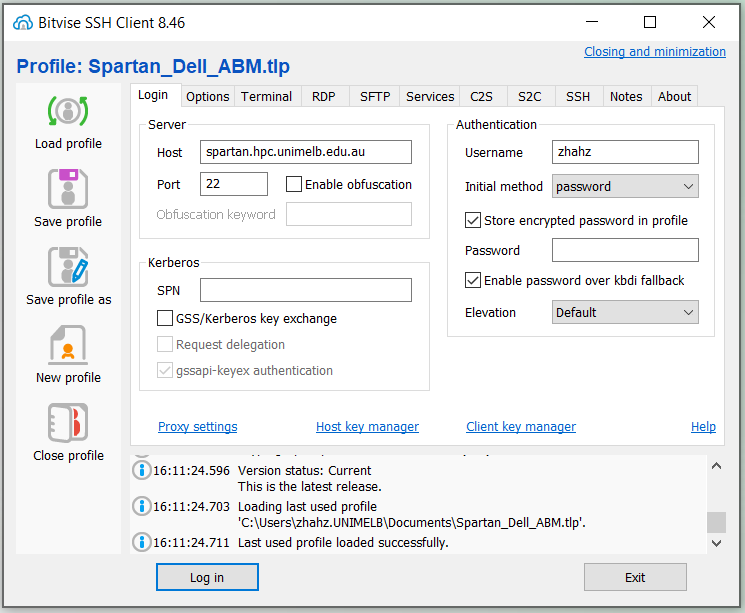
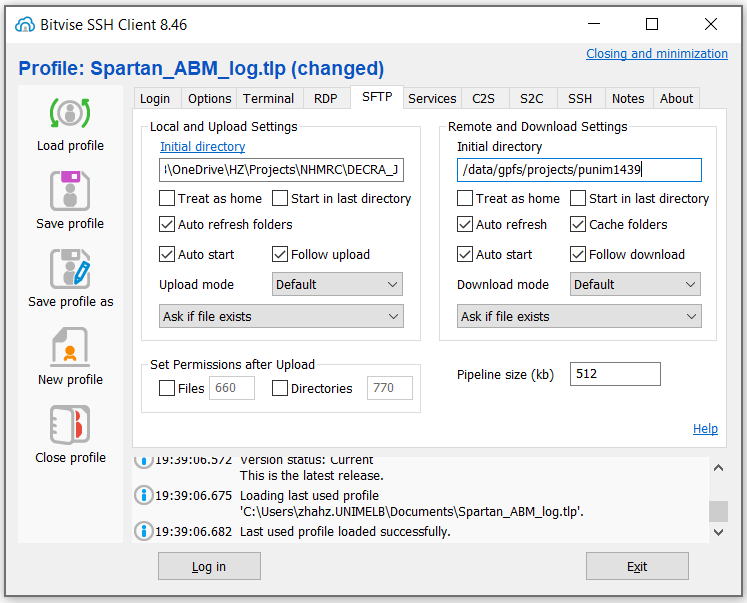
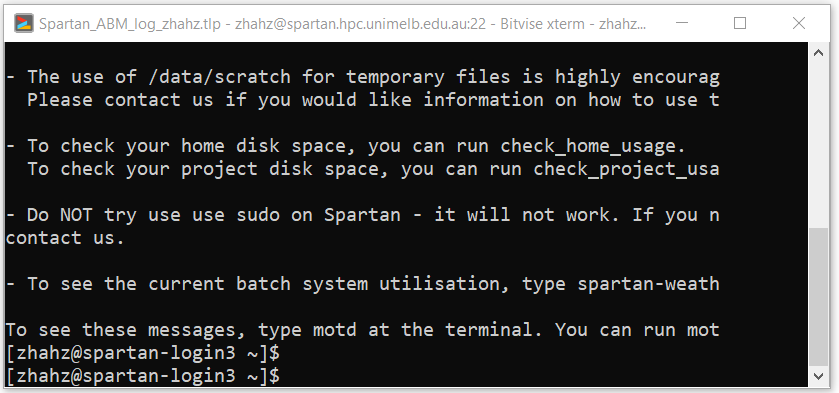
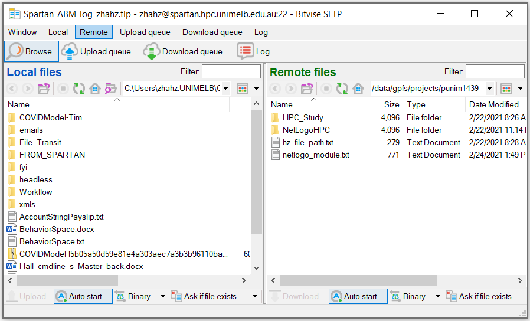
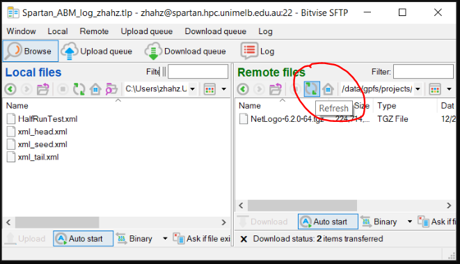

[TOC]

[toc]

## 1. Install SSH Client on laptop

   ### a. Install an SSH client such as [PuTTY](http://www.putty.org/) or [Bitvise](https://www.bitvise.com/ssh-client-download).

   In this example, we installed [Bitvise SSH Client](https://www.bitvise.com/ssh-client-download).

   ### b. Set Bitvise SSH Client

   Tab **[Login]**: Set Host as spartan.hpc.unimelb.edu.au (change here to use the host by your institute), Port as 22 or leave empty, Username as your username, Initial method as password, Store encrypted password in profile as ticked.

   Tab **[Options]**: tick Open Terminal, tick Open SFTP.

 


   Tab **[SFTP]**: Set Remote and Download Settings - Initial directory as an example /data/gpfs/projects/punim1439, leave Initial directory for Local and Upload Settings as empty or your preferred folder on your local computer. 



   ### c. Save profile

   Click [**Save profile**] on the left, so next time you can [**Load profile**] and select the saved profile to load all these settings.

   ### d. Log in Spartan

   Click [**Log in**] button at the bottom, type your password for spartan, which can be different from your staff account password, click [**OK**] to login. This should open a command line window and a SFTP window.

   

   The command line is where you type and run your scripts. 

   

   The SFTP is like the explorer in Windows, where you can create/copy/delete files and folders. You can upload a file to Spartan by dragging a file from left to right, and download a file to your laptop by dragging a file from right to left.

   

    

   ## 2. Install Netlogo on Spartan

    

   In this example, we install NetLogo in this folder /data/gpfs/projects/punim1439/workflow. In SFTP window, right click and Create Folder workflow. 

   Then, in command line, 

   ### a. Run 

   ```
   cd /data/gpfs/projects/punim1439/workflow
   ```

   to change current directory to workflow. 

   ### b. Run

   ```
   wget https://ccl.northwestern.edu/netlogo/6.2.0/NetLogo-6.2.0-64.tgz
   ```

   to download NetLogo installation file to current directory.

   ### c. Run

   ```
   tar -xzf NetLogo-6.2.0-64.tgz
   ```

   to install NetLogo to current directory. 
    

   **Note:** To paste cd /data/gpfs/projects/punim1439/workflow/Test to command line, copy this text and **Right Click** your mouse in command line to paste this text.

   When the NetLogo installation file is downloaded, it may not show in the SFTP window immediately. Click **Refresh**, and the new file will show. 

  
    

    

   

    

   ## 3. Prepare Netlogo model and XML files

   ### a. NetLogo model file

   - If the NetLogo model is on your computer, copy this NetLogo model from your computer to the workflow folder on Spartan (using SFTP window).

   - If the model is on GitHub, download the zip file to your computer first, or clone the latest Git commit directly to Spartan using:

   ```
   git clone https://github.com/~filelocation~
   ```

   - Copy external extensions such as rngs folder to the same directory as where file “.nlogo” is, because for example this model requires rngs extension which is not a default extention of NetLogo software.

   ### b.   XML file

   #### Revise and Run bash create_xmls.sh

   - Revise BEHAVIORSPACE_NAME='~Filename~'

   - Revise filepath NETLOGO_MODEL='xxx/xxx/xxxx/xxx.nlogo'

   - This will create Experiment_auto.xml, head.xml, seed.xml, tail.xml, xmls folder and 100 xml files under xmls folder

   - You can also run the three steps separately (xml_step1n2_.. then xml_step3_.., OR xml_step1.. then xml_step2.. then xml_step3..) 

   On command line, 

   Run 

   ```
   cd /path/to/your/work/directory
   ```

   to change current directory to Test folder. 

   Run 

   ```
   bash create_xmls.sh
   ```

   to create xmls folder and 100 xml files under this folder.

    

   ## 4. Revise and Run sbatch submit_jobarray.slurm

   * Open submit_jobarray.slurm with notepad or notepad++, change Spartan settings, input and/or output file and/or directory names if required. Then run:

   ```
   sbatch submit_jobarray.slurm 
   ```

   to submit 100 jobs to Spartan. You will receive an email when the computation ends. 

   * [#SBATCH](https://dashboard.hpc.unimelb.edu.au/job_submission/) are script directive for Spartan. This script creates a job array of 100 jobs. Each job requires 1 computer node and 8 cpu cores on snowy cluster for a maximum wall time of 2 hours. When all jobs are ended, an email notification will be sent to –mail-user.

   * NETLOGO_SH is about file path of NetLogo software.

   * NETLOGO_MODEL is file path of “xxxx.nlogo” 

   * BASE_FOLDER is current directory of “submit_jobarray.slurm”, and is the upper directory of xmls.

   * OUTPUT_FOLDER, TABLE_SUFFIX, OUTPUT_SUFFIX specify how you want to name output folder and filenames.  

    

   ## 5. Move all slurm_\*.out files to slurm folder (This step is optional)

   When model running is finished, on command line, Run 

   ```
   mkdir -p slurms

   mv ./slurm-*.out ./slurms/
   ```

   to create a folder slurms, and move all slurm-*.out files to slurms folder. 

    

   ## 6. Merge CSV result # need to cd to the file location

   ```
   cd output_folder

   awk '(NR < 8) || (FNR > 7)' *_table_*.csv > MergedResults.csv
   ```

    

   ## 7. Check job status

   On command line, Run 

   ```showq -u```

   to show current jobs. 

    

   ## 8. Other Notes

   + On command line, press Up Arrow key in keyboard to load previous command.

    

   + Put file or directory path in ‘’ or “” if filename includes space, for example

   ```
   cd “/data/gpfs/projects/punim1439/workflow/NetLogo 6.2.0”
   ```

    

   + To cancel a job, run

   ```scancel -n COVIDModel-snowy```

   replace COVIDModel-snowy with your job name

    

   + Run 

   ```spartan-weather```

   to see usage of all partitions

    

   ```Clear```

   to clear screen.

    

   ```Exit```

   to quite command line.
   
   
   <video src="video_to_be_added.mp4" />
